<div align="center">

# Project Prometheus

### The Offline Funding Assistant for Indian Founders

> **"Bringing the Fire of Funding to Every Indian Entrepreneur"**

[](https://github.com)
[](https://python.org)
[](https://github.com)
[](LICENSE)

**Project Prometheus** is a **100% Offline**, **Voice-First**, **Multilingual AI Assistant** designed to democratize access to startup funding for Indian founders. It bridges the gap between complex English bureaucracy and vernacular-speaking entrepreneurs by providing instant, accurate funding information in **Hindi, Marathi, Gujarati, Bengali, Punjabi, and English**—without requiring an internet connection.

[ Quick Start](#-installation--setup) • [📖 Documentation](#-how-to-run) • [🗺️ Roadmap](#️-future-roadmap) • [🤝 Contributing](#-contributing)

</div>

---

## Table of Contents
- [ The Problem](#-the-problem)
- [ Our Solution](#-our-solution)
- [ Key Features](#-key-features)
- [ System Architecture](#️-system-architecture)
- [ Tech Stack](#️-tech-stack)
- [ Installation & Setup](#-installation--setup)
- [ How to Run](#-how-to-run)
- [ Usage Examples](#-usage-examples)
- [ Future Roadmap](#️-future-roadmap)
- [ Contributing](#-contributing)
- [ License](#-license)
- [ Acknowledgments](#-acknowledgments)

---

##  The Problem

India has a thriving startup ecosystem, but access to funding information remains highly unequal:

| Challenge | Impact |
|-----------|--------|
|  **Language Barrier** | 90% of government schemes and funding reports are in complex English, while most Tier-2/3 founders prefer Indic languages |
|  **Unstructured Data** | Critical funding information is trapped in dense PDFs, scattered across multiple websites, and hard to navigate |
|  **Privacy Risks** | Existing AI tools run on cloud servers, exposing sensitive business ideas and financial data to third parties |
|  **Connectivity Issues** | Reliable high-speed internet is not guaranteed in rural innovation hubs where many great ideas originate |
|  **Time Constraints** | Founders waste countless hours searching for relevant schemes instead of building their products |

---

##  Our Solution

Prometheus is your **personal funding assistant** that retrieves hidden funding knowledge and delivers it directly to founders—just like the mythological Titan who brought fire to humanity.

###  Core Principles

```
 Privacy-First    →  100% offline, air-gapped architecture
 Voice-Native     →  Speak naturally in your preferred language
 Accuracy-Driven  →  Hybrid RAG prevents AI hallucinations
 Truly Inclusive  →  Works in 6+ Indian languages
 Zero-Cost        →  Built entirely on open-source technology
```

### How It Works

1. **Ask Naturally** - Speak or type your funding questions in any supported language
2. **Smart Processing** - Hybrid RAG engine searches policies and extracts accurate data
3. **Get Answers** - Receive precise, verified information with sources
4. **Hear Back** - Listen to responses in your preferred language

---

##  Key Features

###  Voice-First & Multimodal
Speak in "Hinglish" or type in Marathi—Prometheus understands both using **OpenAI Whisper** (offline ASR) and supports seamless text input.

###  Multilingual Support
Real-time bi-directional translation for:
- 🇮🇳 **Hindi** (हिंदी)
- 🇮🇳 **Marathi** (मराठी)
- 🇮🇳 **Gujarati** (ગુજરાતી)
- 🇮🇳 **Bengali** (বাংলা)
- 🇮🇳 **Punjabi** (ਪੰਜਾਬੀ)
- 🇬🇧 **English**

###  100% Offline Privacy
- **No Cloud Dependency**: Runs entirely on your local machine
- **No API Keys**: No external service calls or data transmission
- **Air-Gapped**: Can operate without any internet connection
- **Powered by**: Llama 3, Opus-MT, Whisper (all local models)

###  Hallucination-Proof Architecture
Dual-engine RAG system that separates:
- **Text Policies**: Vector search with semantic understanding
- **Financial Data**: Structured data agents for numerical accuracy
- **Source Attribution**: Every answer comes with verifiable sources

### Zero-Cost Solution
Built entirely on open-source software—no subscriptions, no hidden costs, no vendor lock-in.

---

## System Architecture

The system follows a **"Split-Brain" RAG pipeline** to handle qualitative text and quantitative data separately, ensuring maximum accuracy.

```mermaid
graph TB
    subgraph " PHASE 1: Knowledge Ingestion"
        A[ Policy PDFs] --> B{Content Analyzer}
        B -->|Tables & Numbers| C[Tabula Extractor]
        B -->|Text & Policies| D[Tesseract OCR]
        C --> E[Structure Parser]
        D --> F[Text Chunker]
        E --> G[Generate Embeddings]
        F --> G
        G --> H[( ChromaDB Vector Store)]
    end
    
    subgraph " PHASE 2: User Interaction"
        I[ User Input] --> J{Input Type?}
        J -->| Voice| K[Whisper STT]
        J -->| Text| L[Text Processor]
        K --> M{Language Detection}
        L --> M
        M -->|Indic Language| N[EasyNMT Translator]
        M -->|English| O[Query Router]
        N --> O
        O -->|Policy Query| P[Vector Search]
        O -->|Data Query| Q[Pandas Agent]
        P --> R[Context Retriever]
        Q --> R
        R --> S[ Llama 3 Generator]
        S --> T[Response Post-Processor]
        T --> U{Translate Back?}
        U -->|Yes| V[NMT Translation]
        U -->|No| W[Final Output]
        V --> W
        W --> X[ TTS + Text Display]
    end
    
    style H fill:#e1f5ff
    style S fill:#fff3e1
    style X fill:#e8f5e9
```




### Architecture Highlights

- **Hybrid RAG**: Combines vector similarity search with structured data queries
- **Modular Design**: Each component can be upgraded independently
- **Optimized Pipeline**: Minimal latency with local model caching
- **Error Handling**: Graceful fallbacks and robust validation

---

##  Tech Stack

### Core AI Models (All Offline)
| Component | Technology | Purpose |
|-----------|-----------|---------|
| LLM | **Llama 3 (8B)** | Natural language understanding & generation |
| Speech-to-Text | **OpenAI Whisper** | Multilingual voice recognition |
| Translation | **Opus-MT / EasyNMT** | Bidirectional Indic language translation |
| Text-to-Speech | **Piper TTS** | Natural voice synthesis |

### Data Processing
| Component | Technology | Purpose |
|-----------|-----------|---------|
|  PDF Extraction | **Tabula + PyPDF2** | Extract tables and text from PDFs |
|  OCR | **Tesseract** | Optical character recognition |
|  Vector DB | **ChromaDB** | Semantic search and retrieval |
|  Data Analysis | **Pandas + SQLite** | Structured data querying |

### Framework & Infrastructure
```python
{
    "Language": "Python 3.10+",
    "LLM Framework": "LangChain / LlamaIndex",
    "Embeddings": "SentenceTransformers (MiniLM)",
    "API": "FastAPI (Optional)",
    "UI": "Gradio / Streamlit",
    "Deployment": "Docker (Optional)"
}
```

---

##  Installation & Setup

### Prerequisites

- **Python**: 3.10 or higher
- **RAM**: 16GB minimum (32GB recommended for optimal performance)
- **Storage**: 20GB free space for models
- **GPU**: Optional (NVIDIA CUDA for faster inference)

### Quick Installation

```bash
# Clone the repository
git clone https://github.com/yourusername/prometheus.git
cd prometheus

# Create virtual environment
python -m venv venv

# Activate virtual environment
# On Windows:
venv\Scripts\activate
# On macOS/Linux:
source venv/bin/activate

# Install dependencies
pip install -r requirements.txt

# Download required models (one-time setup)
python scripts/download_models.py

# Verify installation
python scripts/verify_setup.py
```

### Manual Model Setup

If automatic download fails:

```bash
# Download Llama 3 (8B)
python -m llama_cpp.download --model llama-3-8b-instruct

# Download Whisper
python scripts/download_whisper.py --model medium

# Download translation models
python scripts/download_translation_models.py
```

---


##  Usage Examples

### Example 1: Voice Query (Hindi)

```
 User: "मुझे महाराष्ट्र में स्टार्टअप के लिए सरकारी योजनाएं बताइए"

 Prometheus: 
"महाराष्ट्र में स्टार्टअप्स के लिए कई योजनाएं उपलब्ध हैं:

1. **महाराष्ट्र स्टार्टअप वीक**
   - फंडिंग: ₹10 लाख तक
   - पात्रता: 3 साल से कम पुराने स्टार्टअप
   
2. **MSINS (Maharashtra State Innovation Society)**
   - अनुदान: ₹25 लाख तक
   - क्षेत्र: Technology & Innovation

📎 स्रोत: Maharashtra Startup Policy 2023, Page 12"
```

### Example 2: Text Query (English)

```
 User: "What are the eligibility criteria for SISFS scheme?"
 Prometheus:
"The Startup India Seed Fund Scheme (SISFS) eligibility criteria are:

 Eligibility:
• Incorporated as a Private Limited Company or LLP
• Registered with DPIIT as a Startup
• Less than 2 years old from date of incorporation
• Working on innovative products/services
• Not received more than ₹10 lakh funding

 Funding: Up to ₹20 lakh seed capital

 Source: SISFS Guidelines 2021, Section 3.2"
```

### Example 3: Data Query

```
 User: "Compare funding amounts across different government schemes"

 Prometheus:
| Scheme | Max Funding | Stage | Sector |
|--------|-------------|-------|--------|
| SISFS | ₹20 lakh | Seed | All |
| SAMRIDH | ₹1 crore | Growth | Tech |
| MAARG | ₹20 lakh | Early | All |
| SCO Fund | ₹15 crore | Late | Strategic |

📎 Source: Compiled from latest scheme documents
```

---