<div align="center">

# 🔥 Project Prometheus

### The Offline Funding Assistant for Indian Founders

> **"Bringing the Fire of Funding to Every Indian Entrepreneur"**

[](https://github.com)
[](https://python.org)
[](https://github.com)
[](LICENSE)

**Project Prometheus** is a **100% Offline**, **Voice-First**, **Multilingual AI Assistant** designed to democratize access to startup funding for Indian founders. It bridges the gap between complex English bureaucracy and vernacular-speaking entrepreneurs by providing instant, accurate funding information in **Hindi, Marathi, Gujarati, Bengali, Punjabi, and English**—without requiring an internet connection.

[🚀 Quick Start](#-installation--setup) • [📖 Documentation](#-how-to-run) • [🗺️ Roadmap](#️-future-roadmap) • [🤝 Contributing](#-contributing)

</div>

---

## 📋 Table of Contents
- [🎯 The Problem](#-the-problem)
- [💡 Our Solution](#-our-solution)
- [✨ Key Features](#-key-features)
- [🏗️ System Architecture](#️-system-architecture)
- [🛠️ Tech Stack](#️-tech-stack)
- [⚡ Installation & Setup](#-installation--setup)
- [🚀 How to Run](#-how-to-run)
- [📊 Usage Examples](#-usage-examples)
- [🗺️ Future Roadmap](#️-future-roadmap)
- [🤝 Contributing](#-contributing)
- [📄 License](#-license)
- [🙏 Acknowledgments](#-acknowledgments)

---

## 🎯 The Problem

India has a thriving startup ecosystem, but access to funding information remains highly unequal:

| Challenge | Impact |
|-----------|--------|
| 🌐 **Language Barrier** | 90% of government schemes and funding reports are in complex English, while most Tier-2/3 founders prefer Indic languages |
| 📚 **Unstructured Data** | Critical funding information is trapped in dense PDFs, scattered across multiple websites, and hard to navigate |
| 🔒 **Privacy Risks** | Existing AI tools run on cloud servers, exposing sensitive business ideas and financial data to third parties |
| 📡 **Connectivity Issues** | Reliable high-speed internet is not guaranteed in rural innovation hubs where many great ideas originate |
| ⏰ **Time Constraints** | Founders waste countless hours searching for relevant schemes instead of building their products |

---

## 💡 Our Solution

Prometheus is your **personal funding assistant** that retrieves hidden funding knowledge and delivers it directly to founders—just like the mythological Titan who brought fire to humanity.

### 🎯 Core Principles

```
🔐 Privacy-First    →  100% offline, air-gapped architecture
🗣️ Voice-Native     →  Speak naturally in your preferred language
🎯 Accuracy-Driven  →  Hybrid RAG prevents AI hallucinations
🌍 Truly Inclusive  →  Works in 6+ Indian languages
💰 Zero-Cost        →  Built entirely on open-source technology
```

### How It Works

1. **💬 Ask Naturally** - Speak or type your funding questions in any supported language
2. **🧠 Smart Processing** - Hybrid RAG engine searches policies and extracts accurate data
3. **📊 Get Answers** - Receive precise, verified information with sources
4. **🔊 Hear Back** - Listen to responses in your preferred language

---

## ✨ Key Features

### 🎤 Voice-First & Multimodal
Speak in "Hinglish" or type in Marathi—Prometheus understands both using **OpenAI Whisper** (offline ASR) and supports seamless text input.

### 🌏 Multilingual Support
Real-time bi-directional translation for:
- 🇮🇳 **Hindi** (हिंदी)
- 🇮🇳 **Marathi** (मराठी)
- 🇮🇳 **Gujarati** (ગુજરાતી)
- 🇮🇳 **Bengali** (বাংলা)
- 🇮🇳 **Punjabi** (ਪੰਜਾਬੀ)
- 🇬🇧 **English**

### 🔒 100% Offline Privacy
- **No Cloud Dependency**: Runs entirely on your local machine
- **No API Keys**: No external service calls or data transmission
- **Air-Gapped**: Can operate without any internet connection
- **Powered by**: Llama 3, Opus-MT, Whisper (all local models)

### 🎯 Hallucination-Proof Architecture
Dual-engine RAG system that separates:
- **📄 Text Policies**: Vector search with semantic understanding
- **📊 Financial Data**: Structured data agents for numerical accuracy
- **✅ Source Attribution**: Every answer comes with verifiable sources

### 💰 Zero-Cost Solution
Built entirely on open-source software—no subscriptions, no hidden costs, no vendor lock-in.

---

## 🏗️ System Architecture

The system follows a **"Split-Brain" RAG pipeline** to handle qualitative text and quantitative data separately, ensuring maximum accuracy.

```mermaid
graph TB
    subgraph "📥 PHASE 1: Knowledge Ingestion"
        A[📜 Policy PDFs] --> B{Content Analyzer}
        B -->|Tables & Numbers| C[Tabula Extractor]
        B -->|Text & Policies| D[Tesseract OCR]
        C --> E[Structure Parser]
        D --> F[Text Chunker]
        E --> G[Generate Embeddings]
        F --> G
        G --> H[(🗄️ ChromaDB Vector Store)]
    end
    
    subgraph "💬 PHASE 2: User Interaction"
        I[👤 User Input] --> J{Input Type?}
        J -->|🎤 Voice| K[Whisper STT]
        J -->|⌨️ Text| L[Text Processor]
        K --> M{Language Detection}
        L --> M
        M -->|Indic Language| N[EasyNMT Translator]
        M -->|English| O[Query Router]
        N --> O
        O -->|Policy Query| P[Vector Search]
        O -->|Data Query| Q[Pandas Agent]
        P --> R[Context Retriever]
        Q --> R
        R --> S[🦙 Llama 3 Generator]
        S --> T[Response Post-Processor]
        T --> U{Translate Back?}
        U -->|Yes| V[NMT Translation]
        U -->|No| W[Final Output]
        V --> W
        W --> X[🔊 TTS + Text Display]
    end
    
    style H fill:#e1f5ff
    style S fill:#fff3e1
    style X fill:#e8f5e9
```




### Architecture Highlights

- **🔄 Hybrid RAG**: Combines vector similarity search with structured data queries
- **🧩 Modular Design**: Each component can be upgraded independently
- **⚡ Optimized Pipeline**: Minimal latency with local model caching
- **🛡️ Error Handling**: Graceful fallbacks and robust validation

---

## 🛠️ Tech Stack

### Core AI Models (All Offline)
| Component | Technology | Purpose |
|-----------|-----------|---------|
| 🧠 LLM | **Llama 3 (8B)** | Natural language understanding & generation |
| 🎤 Speech-to-Text | **OpenAI Whisper** | Multilingual voice recognition |
| 🌐 Translation | **Opus-MT / EasyNMT** | Bidirectional Indic language translation |
| 🔊 Text-to-Speech | **Piper TTS** | Natural voice synthesis |

### Data Processing
| Component | Technology | Purpose |
|-----------|-----------|---------|
| 📄 PDF Extraction | **Tabula + PyPDF2** | Extract tables and text from PDFs |
| 🔍 OCR | **Tesseract** | Optical character recognition |
| 🗃️ Vector DB | **ChromaDB** | Semantic search and retrieval |
| 📊 Data Analysis | **Pandas + SQLite** | Structured data querying |

### Framework & Infrastructure
```python
{
    "Language": "Python 3.10+",
    "LLM Framework": "LangChain / LlamaIndex",
    "Embeddings": "SentenceTransformers (MiniLM)",
    "API": "FastAPI (Optional)",
    "UI": "Gradio / Streamlit",
    "Deployment": "Docker (Optional)"
}
```

---

## ⚡ Installation & Setup

### Prerequisites

- **Python**: 3.10 or higher
- **RAM**: 16GB minimum (32GB recommended for optimal performance)
- **Storage**: 20GB free space for models
- **GPU**: Optional (NVIDIA CUDA for faster inference)

### Quick Installation

```bash
# Clone the repository
git clone https://github.com/yourusername/prometheus.git
cd prometheus

# Create virtual environment
python -m venv venv

# Activate virtual environment
# On Windows:
venv\Scripts\activate
# On macOS/Linux:
source venv/bin/activate

# Install dependencies
pip install -r requirements.txt

# Download required models (one-time setup)
python scripts/download_models.py

# Verify installation
python scripts/verify_setup.py
```

### Manual Model Setup

If automatic download fails:

```bash
# Download Llama 3 (8B)
python -m llama_cpp.download --model llama-3-8b-instruct

# Download Whisper
python scripts/download_whisper.py --model medium

# Download translation models
python scripts/download_translation_models.py
```

---

## 🚀 How to Run

### Option 1: Interactive CLI

```bash
python main.py --mode cli
```

### Option 2: Web Interface (Gradio)

```bash
python main.py --mode web --port 7860
```

Then open your browser to: `http://localhost:7860`

### Option 3: Voice-First Mode

```bash
python main.py --mode voice --language hi
```

### Configuration

Edit `config.yaml` to customize:

```yaml
model:
  llm: "llama-3-8b"
  whisper: "medium"
  embedding: "sentence-transformers/all-MiniLM-L6-v2"

languages:
  default: "en"
  supported: ["en", "hi", "mr", "gu", "bn", "pa"]

performance:
  use_gpu: true
  max_tokens: 512
  temperature: 0.3
```

---

## 📊 Usage Examples

### Example 1: Voice Query (Hindi)

```
🎤 User: "मुझे महाराष्ट्र में स्टार्टअप के लिए सरकारी योजनाएं बताइए"

🤖 Prometheus: 
"महाराष्ट्र में स्टार्टअप्स के लिए कई योजनाएं उपलब्ध हैं:

1. **महाराष्ट्र स्टार्टअप वीक**
   - फंडिंग: ₹10 लाख तक
   - पात्रता: 3 साल से कम पुराने स्टार्टअप
   
2. **MSINS (Maharashtra State Innovation Society)**
   - अनुदान: ₹25 लाख तक
   - क्षेत्र: Technology & Innovation

📎 स्रोत: Maharashtra Startup Policy 2023, Page 12"
```

### Example 2: Text Query (English)

```
💬 User: "What are the eligibility criteria for SISFS scheme?"

🤖 Prometheus:
"The Startup India Seed Fund Scheme (SISFS) eligibility criteria are:

✅ Eligibility:
• Incorporated as a Private Limited Company or LLP
• Registered with DPIIT as a Startup
• Less than 2 years old from date of incorporation
• Working on innovative products/services
• Not received more than ₹10 lakh funding

💰 Funding: Up to ₹20 lakh seed capital

📎 Source: SISFS Guidelines 2021, Section 3.2"
```

### Example 3: Data Query

```
💬 User: "Compare funding amounts across different government schemes"

🤖 Prometheus:
| Scheme | Max Funding | Stage | Sector |
|--------|-------------|-------|--------|
| SISFS | ₹20 lakh | Seed | All |
| SAMRIDH | ₹1 crore | Growth | Tech |
| MAARG | ₹20 lakh | Early | All |
| SCO Fund | ₹15 crore | Late | Strategic |

📎 Source: Compiled from latest scheme documents
```

---

## 🗺️ Future Roadmap

### 🎯 Version 1.0 (Q1 2026)
- [ ] Support for 10+ Indian languages
- [ ] Enhanced PDF parsing for complex tables
- [ ] Mobile app (Android/iOS)
- [ ] Offline voice synthesis improvements

### 🚀 Version 2.0 (Q2-Q3 2026)
- [ ] Multi-document reasoning
- [ ] Scheme recommendation engine
- [ ] Application form auto-filling
- [ ] Integration with government portals (optional online mode)

### 🌟 Version 3.0 (Future)
- [ ] Video content analysis
- [ ] Real-time scheme updates
- [ ] Founder community features
- [ ] Success story database

---

## 🤝 Contributing

We welcome contributions from the community! Here's how you can help:

### Ways to Contribute

1. **🐛 Report Bugs**: Open an issue with detailed reproduction steps
2. **💡 Suggest Features**: Share your ideas for new capabilities
3. **📝 Improve Documentation**: Help us make the docs better
4. **🔧 Submit PRs**: Fix bugs or add features
5. **🌐 Add Languages**: Help us support more Indic languages
6. **📊 Add Data Sources**: Contribute new funding scheme documents

### Development Setup

```bash
# Fork and clone the repo
git clone https://github.com/yourusername/prometheus.git
cd prometheus

# Create a feature branch
git checkout -b feature/amazing-feature

# Make your changes and test
python -m pytest tests/

# Commit and push
git commit -m "Add amazing feature"
git push origin feature/amazing-feature

# Open a Pull Request
```

### Code Guidelines

- Follow PEP 8 style guidelines
- Add unit tests for new features
- Update documentation as needed
- Keep commits atomic and well-described

---

## 📄 License

This project is licensed under the **MIT License** - see the [LICENSE](LICENSE) file for details.

```
MIT License - Free to use, modify, and distribute
Perfect for both personal and commercial projects
```

---

## 🙏 Acknowledgments

- **OpenAI** for Whisper (speech recognition)
- **Meta AI** for Llama 3 (language model)
- **Helsinki-NLP** for Opus-MT translation models
- **Indian Government** for making funding data publicly available
- **Open-Source Community** for incredible tools and libraries

---

<div align="center">

### 🌟 Star this repo if you find it useful!

**Made with ❤️ for Indian Founders**

[⬆ Back to Top](#-project-prometheus)

</div>
