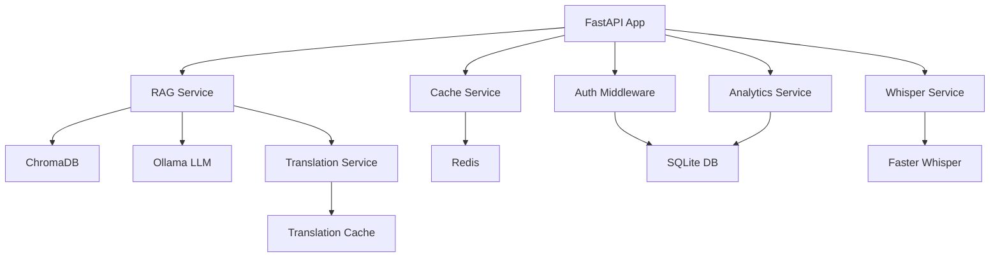

# Prometheus Backend Documentation

## Table of Contents
1. [Overview](#overview)
2. [Architecture](#architecture)
3. [Installation](#installation)
4. [Configuration](#configuration)
5. [API Documentation](#api-documentation)
6. [Services](#services)
7. [Database Schema](#database-schema)
8. [Security](#security)
9. [Testing](#testing)
10. [Deployment](#deployment)

## Overview

Prometheus is a multilingual startup funding query system using RAG (Retrieval-Augmented Generation) architecture. It combines ChromaDB vector search with Ollama LLM to provide accurate, contextual answers about startup funding data.

### Key Features
- 🌐 Multilingual support (English, Hindi, Telugu, Tamil, etc.)
- 🔍 Semantic search using sentence transformers
- 🤖 LLM-powered response generation with Ollama
- 📊 Real-time analytics and insights
- 🎤 Speech-to-text with Whisper
- 🔐 Secure authentication and session management
- ⚡ Redis caching for performance
- 📈 Feedback and rating system

## Architecture

### System Components

```
┌─────────────────────────────────────────────────────────────┐
│                         Frontend                            │
│                    (React + Vite)                           │
└───────────────────────────┬─────────────────────────────────┘
                            │ HTTP/WebSocket
┌───────────────────────────┴─────────────────────────────────┐
│                    FastAPI Backend                          │
│  ┌──────────────────────────────────────────────────────┐   │
│  │           Middleware Layer                           │   │
│  │  - CORS  - Auth  - Rate Limiting  - Logging         │   │
│  └──────────────────────────────────────────────────────┘   │
│  ┌──────────────────────────────────────────────────────┐   │
│  │                 Route Handlers                       │   │
│  │  - /auth  - /rag  - /chat  - /analytics             │   │
│  └──────────────────────────────────────────────────────┘   │
│  ┌──────────────────────────────────────────────────────┐   │
│  │               Service Layer                          │   │
│  │  - RAG  - Translation  - Cache  - Analytics         │   │
│  └──────────────────────────────────────────────────────┘   │
└───────────────────────────┬─────────────────────────────────┘
                            │
┌───────────────────────────┴─────────────────────────────────┐
│                  Data & External Services                   │
│  ┌─────────┐  ┌─────────┐  ┌─────────┐  ┌─────────┐       │
│  │ SQLite  │  │ ChromaDB│  │  Redis  │  │ Ollama  │       │
│  │   DB    │  │ Vectors │  │  Cache  │  │   LLM   │       │
│  └─────────┘  └─────────┘  └─────────┘  └─────────┘       │
└─────────────────────────────────────────────────────────────┘
```

### Service Dependencies



### Initialization Order

Critical! Services must initialize in this order:

1. **Config Validation** - Validate all environment variables
2. **Database Connection** - Initialize SQLite database
3. **Migrations** - Apply pending database migrations
4. **ChromaDB** - Initialize vector store
5. **Embedding Model** - Load sentence transformer
6. **Redis** (optional) - Connect to cache
7. **Ollama Client** - Initialize LLM connection
8. **Translation Cache** - Load cached translations
9. **Celery** (optional) - Start background tasks
10. **FastAPI App** - Start web server

## Installation

### Prerequisites
- Python 3.9+
- Ollama (for LLM)
- Redis (optional, for caching)
- 8GB+ RAM (for embeddings)

### Quick Start

```bash
# Clone repository
git clone https://github.com/sai-chakrith/Prometheus.git
cd Prometheus/prometheus-ui/backend

# Create virtual environment
python -m venv venv
source venv/bin/activate  # On Windows: venv\Scripts\activate

# Install dependencies
pip install -r requirements.txt

# Copy and configure environment
cp .env.example .env
# Edit .env with your settings

# Validate configuration
python config_validator.py

# Run migrations
python migrations.py migrate

# Initialize dataset
python -c "import database; database.init_db()"

# Start server
python main.py
```

### Docker Installation

```bash
cd prometheus-ui
docker-compose up -d
```

## Configuration

### Environment Variables

See `.env.example` for all available configuration options.

#### Critical Settings

**SECRET_KEY** (REQUIRED in production)
```bash
# Generate secure key
openssl rand -hex 32

# Set in .env
SECRET_KEY=your-generated-key-here
```

**Database Paths**
```bash
DATABASE_PATH=prometheus.db
CHROMA_PATH=chroma_db
```

**Ollama Configuration**
```bash
OLLAMA_BASE_URL=http://localhost:11434
OLLAMA_MODEL=llama3.1:8b
```

#### Optional Settings

**Redis Caching**
```bash
REDIS_ENABLED=true
REDIS_HOST=localhost
REDIS_PORT=6379
REDIS_TTL=3600
```

**Rate Limiting**
```bash
RATE_LIMIT_ENABLED=true
LOGIN_RATE_LIMIT=5/minute
API_RATE_LIMIT=100/minute
```

### Configuration Validation

Run validation before starting:

```bash
python config_validator.py
```

This checks:
- All required variables are set
- Values are in valid ranges
- URLs are properly formatted
- Secret keys are secure
- File paths are accessible

## API Documentation

### Interactive Documentation

Once running, access:
- **Swagger UI**: http://localhost:8000/api/docs
- **ReDoc**: http://localhost:8000/api/redoc
- **OpenAPI JSON**: http://localhost:8000/api/openapi.json

### Authentication Endpoints

#### POST /signup
Register new user

**Request:**
```json
{
  "username": "user123",
  "email": "user@example.com",
  "password": "SecurePass123!"
}
```

**Response:**
```json
{
  "id": 1,
  "username": "user123",
  "email": "user@example.com",
  "created_at": "2024-01-07T10:00:00Z"
}
```

#### POST /login
Authenticate user

**Request:**
```json
{
  "username": "user123",
  "password": "SecurePass123!"
}
```

**Response:**
```json
{
  "session_id": "abc123...",
  "user_id": 1,
  "username": "user123"
}
```

### RAG Endpoints

#### POST /rag
Query funding data

**Request:**
```json
{
  "query": "What are top fintech startups in Bangalore?",
  "language": "en"
}
```

**Response:**
```json
{
  "answer": "Based on the funding data...",
  "sources": [...],
  "metadata": {
    "processing_time": 1.23,
    "model": "llama3.1:8b"
  }
}
```

#### POST /rag-stream
Streaming RAG query (SSE)

Returns Server-Sent Events stream of response chunks.

### Chat History Endpoints

#### GET /history
Get user's chat history

**Headers:** `X-Session-Id: <session_id>`

**Response:**
```json
{
  "history": [
    {
      "id": 1,
      "query": "...",
      "response": "...",
      "timestamp": "..."
    }
  ]
}
```

#### POST /save-chat
Save chat to history

**Request:**
```json
{
  "query": "...",
  "response": "...",
  "session_id": "..."
}
```

### Analytics Endpoints

#### GET /analytics/overview
Get usage analytics

**Response:**
```json
{
  "total_queries": 1000,
  "unique_users": 50,
  "avg_rating": 4.5,
  "popular_sectors": [...]
}
```

## Services

### RAG Service

Located in `services/rag_service.py`

**Responsibilities:**
- Query processing and expansion
- Vector search in ChromaDB
- Context retrieval
- LLM prompt generation
- Response generation

**Dependencies:**
- ChromaDB (vector store)
- Ollama (LLM)
- Translation Service (multilingual)

### Translation Service

Located in `services/translation_service.py`

**Features:**
- Automatic language detection
- Transliteration for Indian languages
- Translation caching
- Batch translation support

**Cached Terms:**
Pre-loaded common terms (sectors, cities) for faster response.

### Cache Service

Located in `services/cache_service.py`

**Strategies:**
- Query result caching
- Translation caching
- Session caching
- TTL-based expiration

### Analytics Service

Located in `services/analytics_service.py`

**Metrics Tracked:**
- Query counts
- User engagement
- Response times
- Ratings and feedback
- Sector popularity

## Database Schema

### Users Table
```sql
CREATE TABLE users (
    id INTEGER PRIMARY KEY AUTOINCREMENT,
    username TEXT UNIQUE NOT NULL,
    email TEXT UNIQUE NOT NULL,
    password_hash TEXT NOT NULL,
    created_at TIMESTAMP DEFAULT CURRENT_TIMESTAMP,
    deleted_at TIMESTAMP
);
```

### Chat History Table
```sql
CREATE TABLE chat_history (
    id INTEGER PRIMARY KEY AUTOINCREMENT,
    session_id TEXT NOT NULL,
    user_id INTEGER,
    query TEXT NOT NULL,
    response TEXT NOT NULL,
    timestamp TIMESTAMP DEFAULT CURRENT_TIMESTAMP,
    deleted_at TIMESTAMP,
    FOREIGN KEY (user_id) REFERENCES users(id)
);
```

### Feedback Table
```sql
CREATE TABLE feedback (
    id INTEGER PRIMARY KEY AUTOINCREMENT,
    user_id INTEGER,
    query TEXT NOT NULL,
    response TEXT NOT NULL,
    rating INTEGER CHECK(rating BETWEEN 1 AND 5),
    comment TEXT,
    timestamp TIMESTAMP DEFAULT CURRENT_TIMESTAMP,
    deleted_at TIMESTAMP,
    FOREIGN KEY (user_id) REFERENCES users(id)
);
```

### Analytics Table
```sql
CREATE TABLE analytics (
    id INTEGER PRIMARY KEY AUTOINCREMENT,
    event_type TEXT NOT NULL,
    user_id INTEGER,
    session_id TEXT,
    metadata TEXT,
    timestamp TIMESTAMP DEFAULT CURRENT_TIMESTAMP,
    FOREIGN KEY (user_id) REFERENCES users(id)
);

CREATE INDEX idx_analytics_event ON analytics(event_type);
CREATE INDEX idx_analytics_timestamp ON analytics(timestamp);
```

### Migrations

Use the migration system:

```bash
# Check status
python migrations.py status

# Apply all migrations
python migrations.py migrate

# Apply to specific version
python migrations.py migrate 3

# Rollback to version
python migrations.py rollback 2
```

## Security

### Authentication
- Password hashing with bcrypt
- Session-based authentication
- Configurable session expiry

### Rate Limiting
- Per-IP rate limiting
- Separate limits for login vs API
- Configurable thresholds

### Input Validation
- Pydantic models for all inputs
- SQL injection prevention
- XSS protection

### Best Practices
1. **Never commit .env files**
2. **Use strong SECRET_KEY in production**
3. **Enable HTTPS in production**
4. **Regular security updates**
5. **Monitor rate limit violations**

## Testing

### Running Tests

```bash
# Install test dependencies
pip install -r requirements-test.txt

# Run all tests
pytest

# Run with coverage
pytest --cov=. --cov-report=html

# Run specific test file
pytest tests/test_validators.py

# Run specific test
pytest tests/test_validators.py::TestRagRequestValidator::test_valid_query
```

### Test Structure
```
tests/
├── conftest.py              # Test fixtures
├── test_validators.py       # Validation tests
├── test_utils.py           # Utility tests
├── test_integration.py     # API integration tests
└── test_services.py        # Service layer tests
```

### Writing Tests

Example test:
```python
def test_rag_query(client, test_user):
    response = client.post("/rag", json={
        "query": "What are top fintech startups?"
    })
    assert response.status_code == 200
    assert "answer" in response.json()
```

## Deployment

### Production Checklist

- [ ] Set secure `SECRET_KEY`
- [ ] Disable `DEBUG=false`
- [ ] Configure production database
- [ ] Set up Redis for caching
- [ ] Configure proper CORS origins
- [ ] Set up SSL/TLS certificates
- [ ] Configure reverse proxy (Nginx)
- [ ] Set up monitoring and logging
- [ ] Run database migrations
- [ ] Validate configuration
- [ ] Set up backup strategy
- [ ] Configure rate limiting
- [ ] Set resource limits

### Docker Deployment

```bash
# Build and start
docker-compose up -d

# View logs
docker-compose logs -f backend

# Scale services
docker-compose up -d --scale backend=3

# Stop services
docker-compose down
```

### Monitoring

Recommended monitoring:
- Application logs
- Error rates
- Response times
- Database performance
- Redis hit rates
- Ollama service health

### Backup Strategy

1. **Database Backups**
```bash
# Backup SQLite
sqlite3 prometheus.db ".backup 'backup-$(date +%Y%m%d).db'"
```

2. **ChromaDB Backups**
```bash
# Backup vector store
tar -czf chroma-backup-$(date +%Y%m%d).tar.gz chroma_db/
```

3. **Automated Backups**
Set up cron job for daily backups.

## Troubleshooting

### Common Issues

**Ollama Connection Failed**
- Check Ollama is running: `ollama list`
- Verify OLLAMA_BASE_URL
- Test connection: `curl http://localhost:11434/api/tags`

**ChromaDB Initialization Failed**
- Check disk space
- Verify CHROMA_PATH permissions
- Delete and reinitialize if corrupted

**Redis Connection Failed**
- Set `REDIS_ENABLED=false` to disable
- Check Redis is running: `redis-cli ping`
- Verify REDIS_HOST and REDIS_PORT

**Migration Errors**
- Check database file permissions
- Backup database before migration
- Review migration logs

## Support

For issues or questions:
- GitHub Issues: https://github.com/sai-chakrith/Prometheus/issues
- Documentation: See README.md
